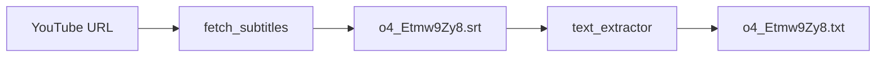

# Извлечение субтитров с YouTube

## Цель

Для видео [https://www.youtube.com/watch?v=o4_Etmw9Zy8](https://www.youtube.com/watch?v=o4_Etmw9Zy8):

1. Сохранить субтитры **в полном формате** — файл `.srt` (номер, таймкоды, текст).
2. Из `.srt` сгенерировать **один текстовый файл** `.txt` — только текст речи, без таймкодов.

Все исходники останутся в проекте [`c:\java\youtube-get-subtitles`](c:\java\youtube-get-subtitles).

## Архитектура



## Стек

- **Python 3.10+**
- Библиотека [`youtube-transcript-api`](https://github.com/jdepoix/youtube-transcript-api) — оригинальный Python-пакет, без API-ключа YouTube

```python
from youtube_transcript_api import YouTubeTranscriptApi

transcript = YouTubeTranscriptApi.get_transcript("o4_Etmw9Zy8")
# [{'text': '...', 'start': 0.0, 'duration': 2.5}, ...]
```

Почему Python, а не Java:
- Библиотека родная, активно поддерживается, `pip install` — и готово
- Меньше бойлерплейта (~100 строк вместо Maven + 5 Java-классов)
- Тот же механизм: внутренние эндпоинты YouTube, не официальный API

## Структура проекта

```
youtube-get-subtitles/
├── requirements.txt
├── README.md
├── main.py                  # CLI: URL → SRT → TXT
├── video_id.py              # извлечение video ID из URL
├── fetch_subtitles.py       # загрузка субтитров через youtube-transcript-api
├── srt_writer.py            # конвертация сегментов → SRT
├── text_extractor.py        # парсинг SRT → plain text
└── output/
    ├── o4_Etmw9Zy8.srt      # полный формат (результат запуска)
    └── o4_Etmw9Zy8.txt      # только текст (результат запуска)
```

## Реализация по шагам

### 1. Зависимости (`requirements.txt`)

```
youtube-transcript-api>=1.0.0
```

Установка: `pip install -r requirements.txt`

### 2. `fetch_subtitles.py` + `srt_writer.py`

- По video ID вызвать `YouTubeTranscriptApi.get_transcript(video_id)`
- Если есть несколько языков — приоритет: `ru` → `en` → первый доступный (через `list_transcripts()`)
- `srt_writer.py` записывает `.srt`:
  - порядковый номер
  - `HH:MM:SS,mmm --> HH:MM:SS,mmm`
  - текст сегмента
  - пустая строка между блоками

### 3. `text_extractor.py`

- Прочитать `.srt`, пропустить номера и таймкоды
- Собрать текст сегментов в один поток
- Убрать дублирующиеся перекрывающиеся фразы (для auto-generated субтитров)
- Записать `.txt` в UTF-8

### 4. `main.py` (CLI)

```
python main.py <youtube-url-or-video-id> [output-dir]
```

По умолчанию `output-dir` = `output/`. Последовательно:
1. Парсит video ID
2. Сохраняет `{videoId}.srt`
3. Генерирует `{videoId}.txt` из SRT
4. Печатает пути к обоим файлам

### 5. Запуск для целевого видео

```bash
cd c:\java\youtube-get-subtitles
pip install -r requirements.txt
python main.py https://www.youtube.com/watch?v=o4_Etmw9Zy8
```

Ожидаемый результат:
- [`output/o4_Etmw9Zy8.srt`](output/o4_Etmw9Zy8.srt) — полные субтитры
- [`output/o4_Etmw9Zy8.txt`](output/o4_Etmw9Zy8.txt) — чистый текст

## Обработка ошибок

- Неверный URL → понятное сообщение
- Субтитры недоступны → `TranscriptsDisabled` / `NoTranscriptFound`
- Сеть недоступна → сообщение об ошибке соединения

## README

Краткая инструкция: требования (Python 3.10+), `pip install`, запуск, описание выходных файлов.
